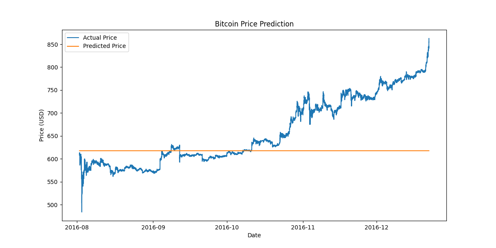

## **An Introduction to Time Series Forecasting:**

Time series forecasting is the process of analysing time series data using statistics and modelling to make predictions and inform strategic decision-making. It involves building models through historical analysis and using them to make observations and drive future strategic decision-making. This forecasting method helps identify trends, manage risks, and inform strategic planning, ultimately enhancing decision-making processes. 

Time series analysis is a useful tool to examine the characteristics of Bitcoin prices and returns and extract important statistics to forecast future values of the series. By forecasting BTC prices, investors can better navigate market fluctuations, identify optimal entry and exit points, and develop data-driven investment strategies.

## **Preprocessing Method:**

- **Data loading:** The bitcoin [dataset](https://drive.google.com/file/d/16MgiuBfQKzXPoWFWi2w-LKJuZ7LgivpE/view) used was loaded from a CSV file containing a 1-minute interval data.
- **Checking and handling missing data:** Realizing the dataset had over 106503 missing values in all the columns except for the timestamp column. The missing data was handled using the fill-forward method. This method was used because it maintains the continuity of the data. It assumes that the last known price is a reasonable estimate for subsequent time points since the prices do not change drastically from one minute to the next.
- **Timestamp conversion:** The timestamp column was in the Unix time format which is used in computing but yet it was difficult to be read. Thus, it was converted to a more human-readable datetime format. The timestamp column was converted to a datetime type and set it as the index.
- **Feature Selection:** We focus on the 'Close' price as the target variable for prediction.
- **Normalisation:** We apply min-max scaling to normalize the price data to a range of [0, 1].

```python
df = pd.read_csv("coinbaseUSD_1-min_data_2014-12-01_to_2019-01-09.csv")

#Forward-fill
df.fillna(method='ffill', inplace=True)

# Converting the 'Timestamp' from Unix time to a readable datetime format
df['Datetime'] = pd.to_datetime(df['Timestamp'], unit='s', utc=True)

# Removing timezone info
df['Datetime'] = df['Datetime'].dt.tz_convert(None)

# Set 'Datetime' as the index of the DataFrame
df.set_index('Datetime', inplace=True)

# Drop the original 'Timestamp' column
df.drop('Timestamp', axis=1, inplace=True)

# select close price
close_prices = df['Close'].values.reshape(-1, 1)

# normalize the close price data
scaler = MinMaxScaler()
close_price_scaled = scaler.fit_transform(close_prices)
```


## **Setting Up tf.data.Dataset for Model Inputs:**
We used TensorFlow's ```tf.data.Dataset``` API to create an efficient input pipeline:

1. We created sequences of 96 time steps (or 24 hours of 1-minute data) to predict the next time step.
2. The data is split into training (80%) and testing (20%) sets.
3. We use batching and prefetching to optimize performance.

```python
# Creating the dataset fxn
def create_dataset(data, time_steps=96):
    x, y = [], []
    for i in range(len(data) - time_steps):
        x.append(data[i:(i + time_steps)])
        y.append(data[i + time_steps])
    return np.array(x), np.array(y)

time_steps = 96 # 24 hours of 1 minute data

# Create datasets
X, y = create_dataset(close_price_scaled, time_steps)

train_size = int(len(X) * 0.8)
X_train, X_test = X[:train_size], X[train_size:]
y_train, y_test = y[:train_size], y[train_size:]

train_dataset = tf.data.Dataset.from_tensor_slices((X_train, y_train))
test_dataset = tf.data.Dataset.from_tensor_slices((X_test, y_test))

batch_size = 32
train_dataset = train_dataset.batch(batch_size).prefetch(tf.data.experimental.AUTOTUNE)
test_dataset = test_dataset.batch(batch_size).prefetch(tf.data.experimental.AUTOTUNE)
```


Importance of the above techniques in time series data:
- Batching allows for processing multiple data points simultaneously, improving computational efficiency and reducing training time.
- Windowing allows the model to learn from historical patterns.
- Prefetching ensures data is ready for the next training step, reducing idle time.


## **Model Architecture:**

A stacked LSTM network was used, and this is because:

```python
model = Sequential([
    LSTM(50, activation='relu', return_sequences=True, input_shape=(time_steps, 1)),
    LSTM(50, activation='relu'),
    Dense(1)
])

model.compile(optimizer=Adam(learning_rate=0.001), loss='mse')
model.summary()
```

- LSTM networks are well-suited for sequence prediction tasks and can capture long-term dependencies in time series data.
- The two LSTM layers allow the model to learn more complex patterns.
- ReLU activation helps mitigate the vanishing gradient problem.
- Adam optimizer adapts the learning rate during training for better convergence.


## Results and Evaluation:

After training the model, we achieved the following performance metrics:

- Train MSE: 0.1530

- Test MSE: 0.0123

- Mean Absolute Error (MAE): $62.90

- Root Mean Square Error (RMSE): $83.51

Here is a visualization of the model's predictions compared to the actual Bitcoin prices:




Insights from the BTC Price Prediction plot:

- The plot shows that the model had difficulty capturing the general trend of Bitcoin prices over the period, as observed from the predicted prices (orange line) being constant throughout as compared to the actual prices (blue line) that have been fluctuating. This indicates that the **LSTM model may not have effectively learned** from the historical data. This likely results from **using only 4 epochs for training, which limited the model's ability to learn patterns** effectively. 


## Conclusion

This project has been both rewarding and challenging at thesame time. This project was able to offer insights about the challenges and potential of applying deep learning to financial time series data.

- **Challenges encountered:**
  - High volatility of Bitcoin prices makes accurate prediction difficult.
  - Complex models like LSTM require careful tuning and may overfit or underfit the data.
  - Training deep learning models can be resource-intensive, limiting the ability to experiment with different architectures
  - Required alot of time for training.

- **Potential & future work:**
  - Experimenting with different architectures like GRU
  - Optimizing hyperparameters
  - Increasing the number of epochs used in the training to enable the model to learn better from the data, balancing computation time with performance.